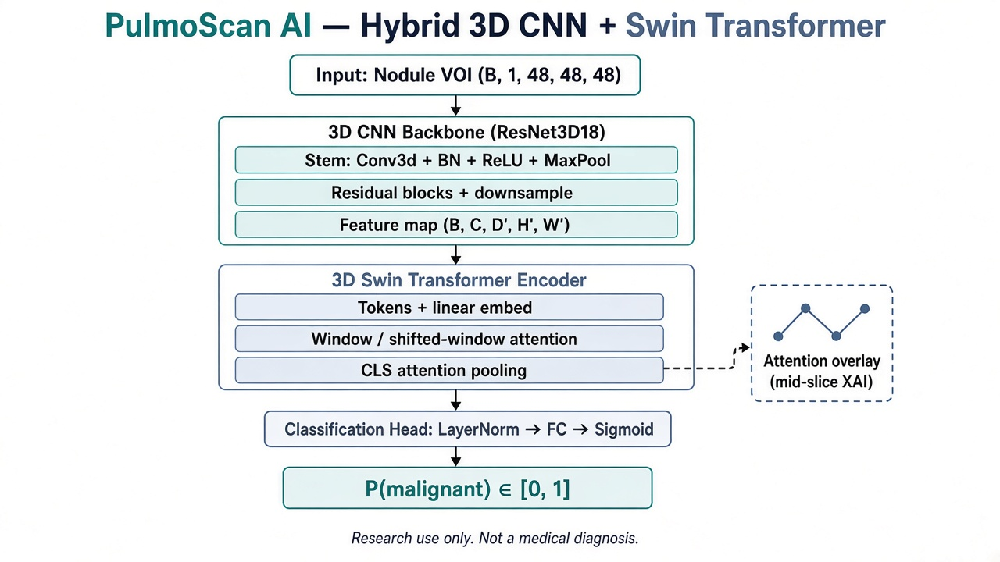
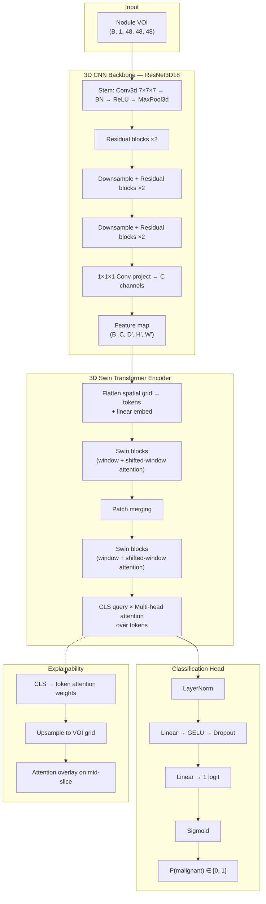
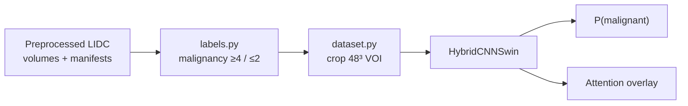

# Model Architecture — Hybrid 3D CNN + Swin

Research use only. Not a medical diagnosis.

## Downloadable images

- Mermaid render: [`docs/images/hybrid_cnn_swin_architecture.png`](images/hybrid_cnn_swin_architecture.png)
- SVG: [`docs/images/hybrid_cnn_swin_architecture.svg`](images/hybrid_cnn_swin_architecture.svg)
- Report-style poster: [`docs/images/pulmoscan-hybrid-cnn-swin-architecture.png`](images/pulmoscan-hybrid-cnn-swin-architecture.png)

## Diagram (Mermaid source)

## Pipeline (system view)

## Code map

| Block | File |
|-------|------|
| 3D CNN | `src/pulmoscan/classification/backbone_cnn.py` |
| Swin | `src/pulmoscan/classification/swin3d.py` |
| Hybrid glue + head | `src/pulmoscan/classification/model.py` |
| Config | `configs/model/hybrid_cnn_swin.yaml` |
